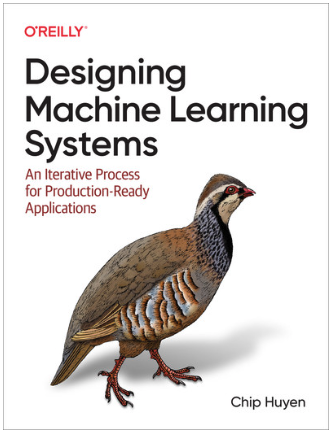
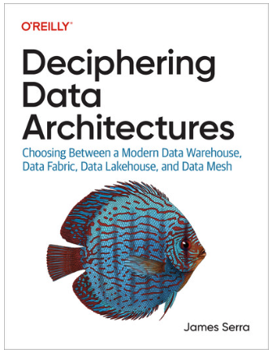
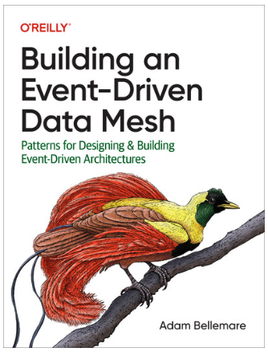
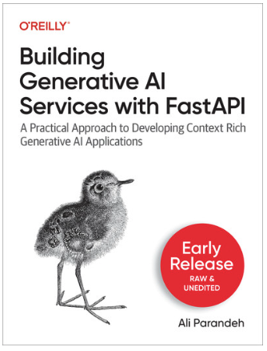

# Machine Learning Systems for Production

This repository contains materials for the "Machine Learning Systems for Production" course by [Thar Htet San](https://github.com/tharhtetsan). The lecture videos are available on the [Deepfaro YouTube channel](https://www.youtube.com/@deepfaro). This course focuses on MLOps, covering the following key topics:

- Addressing technical debts in MLOps.
- Framing problems as ML solutions.
- Approaching ML systems using current project management techniques.
- Setting up a development environment for ML projects.
- Creating an ML lifecycle management system.
- Handling data drift, model drift, and monitoring in ML systems.
- Systematically managing the ongoing development of ML systems.

### Course Timetable
#### July 2024
##### Category : <b> Programming, Logic, ML Basic </b>
|Date | Title | Description | Video + Source Code  |
|-----|-----|-----|-----|
|13-7-2024 | Python Basic | - Programming Discussion, OOP and some basic design pattern | [Day-1](https://youtu.be/_IXDpQksQ-M)|
|14-7-2024|Enviroment Setup| - Setting up for prod and dev.   - Solving dependencies conflicts for Development and Prod | [Day-2](https://youtu.be/49iP3qvKgg8)|
|20-7-2024 | Image Processing Techniques | - Basic Image Processing Techniques.   - BGR and RGB.   - Image lib : OpenCV and Pillow.   - Line detection Sample Project | [Day-3](https://youtu.be/e5-31ef4Ofk) |
|21-7-2024 | OCR Project   | - Applying image processing techniques.   - Template Matching   - Google Vision API.  | [Day-4](https://youtu.be/dup78khJDxs)|
|27-7-2024 |Basic ML Algorithms - 1 | - Decision Tree   - K-Means Clustering  | [Day-5](https://youtu.be/ilEPlk8ocnU) |
|28-7-2024 | Basic ML Algorithms - 2  Basic DL Algorithms - 1 | - Linear Regression using Least Squares   - Naive-Bayes-Classifier  - ANN and Single perceptron (from scratch ) | [Day-6](https://youtu.be/2vj996L2rsY)|

#### August 2024
##### Category : <b> Logic, ML Basic, Tensorflow, Pytroch, Cloud Basic </b>
|Date | Title | Description | Video+Source |
|-----|-----|-----|-----|
|3-8-2024| Basic DL Algorithms - 2 | - CNN Details.   - How calculate trainable parameters.   - Why CNN is better than ANN in Computer vision problem.   | [Day-7](https://youtu.be/6qaSiebD5ZQ)|
|4-8-2024|  Basic Deep Learning-3  | - Env Setup for ML project   - Tensorflow Basic   - Tensorflow Data Generators.   - Learning Rate Scheduler   - Tensorboard   - Model Saving and Loading| [Day-8](https://youtu.be/lMk1IdZvf58)|
|10-8-2024|   Basic Deep Learning-4  | - Creating Custom Data Generators  - Beyond the Sequential Deeplearing models  - Saving and Loading custom DL models | [Day-9  ](https://youtu.be/qR9U2vQRjzQ) |
|11-8-2024| Setup Production ready ML system. | - Understanding Flask   - Env Setup for Dev and Prod   - Contrainerization ML project   - Getting Start with FastAPI. |  [Day-10  ](https://youtu.be/Qe3iXw-KDz0)|
|17-8-2024| Deployment |  Binary Classification ကို Tensorflow နဲ့ တည်ဆောက်ပုံ   -  Various type of  Model Saving and Loading techniques.   - FastAPI basic    - FastAPI lifespan and asynccontextmanager| [Day-11  ](https://youtu.be/eB8ufI2C9kQ) |
|18-8-2024| Getting Start with pySpark | - Async နဲ့ Sync Method တို့ရဲ့ အလုပ်လုပ်ပုံနဲ့ ကွာခြားပုံ  - Deploying Custom Tensorflow model   - LLM Studio အလုပ်လုပ်ပုံနဲ့ ကျွန်တော်တို့ဘယ်လိုသုံးလို့ရလဲ။  - Data Version Problems တွေ နဲ့  Data Version Control မိတ်ဆက်| [Day-12  ](https://youtu.be/RQgrUp7LGC0) |
|24-8-2024| Containerzation for ML Projects  |- Text Generation model  - Text to Audio model   - FastAPI အကြောင်းနှင့်  - ML Systems တွေအသုံးများတဲ့ Design Pattern တွေအကြောင်းတွေကိုပြောပြထားပါတယ်။ | [Day-13  ](https://youtu.be/Xi0oaat50lw) |
|25-8-2024| ML Systems Deployments | - GCP IAM Setup   - Data Version Control  - Text Generation Model  | [Day-14  ](https://youtu.be/Qe3iXw-KDz0)|
|31-8-2024| Deploy ML project on CloudRun| - Abstractmethod in ML proj   - IAM in Google Cloud Platform  - GCP Cost Calculator  - CloudRun  - Dev/Stg/Prod Setup  - Github Action vs Third party triggers | [Day-15  ](https://youtu.be/PxJe-zDmmxA)|

#### September 2024
##### Category : <b> MLOps Tools, Cloud essentials, model and experiment tracking </b>

|Date | Title | Description | Reference |
|-----|-----|-----|-----|
|1-9-2024| ML deployment using Custom CI/CD pipeline setup |- Setting up custom ci/cd pipeline  setup.  - prod/stg/dev environment setup. - GCP cost calculation and discounts. - system based libs vs normal libs  - [Project-1: ML System on Serverless with custom CI/CD](https://github.com/tharhtetsan/ML_in_Prod_batch_1_proj) |[Day-16  ](https://youtu.be/qxktCHfp8p8)|
|7-9-2024| Cloud Build Speed Up and libs handling | - OS based libs Error handling   - Speed up the building process | [Day-17](https://youtu.be/n4kMRYa0g1E)|
|8-9-2024| Deploy Text to Audio Model and Start with GCE  |- Serverless vs Serverbase  - Autoscaling in CloudRun   - Serverless challenges for ML systems   - Compute Engine | [Day-18](https://youtu.be/DUpJJsW1k9Y)|
|14-9-2024| Manage Instance Group and GCE CI/CD | - Compute Engine   - Instance Templates and how it works   - Mange Instance Group   - Artifact Registry and how can we use it.  - CI/CD Setup for Manage Instance Group(MIG)   [Project-2: ML System on MIG with custom CI/CD](https://github.com/tharhtetsan/ML_in_Prod_batch_1_proj2)| [Day-19](https://youtu.be/5AU0rKYVrDQ) |
|15-9-2024| IMG Templates and Container images handling | - Manage Instance Group Template   - CI/CD setup for stg and prod   - Cloud Functions logic and how we can use it.   - Handling old  MIG templates   - Cloud Scheduler   - Introduction to MLflow | [Day-20](https://youtu.be/uNDj4MdBu0k)|
|21-9-2024|  Experiment Tracking with MLflow Part-1 | - Experiment Tracking logic and why   - Popular experiment tools   - MLflow env   - MLflow runs handling   - Auto logging  vs manual logging in MLflow   - sklearn model training and inference with MLflow | [Day-21](https://youtu.be/ueC9GvqAgQ8) |
|22-9-2024| Experiment Tracking with MLflow Part-2  | - System metrics and GPU metrics logging in MLflow   - Run Id searching   - Add MLflow tracking in Tensorflow notebook   - Model signature and TF model logging   - MLflow model registry   - Register model name and version   - Loading the model by tag | [Day-22](https://youtu.be/kfVgvIINjbU) |
|28-9-2024| Sorry guys!  ThaHtet was sick on that day  🥹 | - | -|
|29-9-2024| Secure MLflow Server for Org Part-1 | - Setup Secure MLflow Server for the Org.   - Cloud SQL   - Cloud Storage Object   - GCP Secret Manager   [Project-3:Secure MLflow Server setup for production](https://github.com/tharhtetsan/Secure-MLflow-Server-for-production)| [Day-23](https://youtu.be/ZImUpfdTvxM)|

#### October 2024
##### Category : <b> MLOps Tools, Monitoring, Piplines</b>
|Date | Title | Description | Reference |
|-----|-----|-----|-----|
|5-10-2024| Experiment Tracking with MLflow and Monitoring Part-1 |- MLflow server on CloudRun   - Why we need monitoring in ML Systems.   - Data drift   - Concept drift   - Model drift vs Data drift vs Concept drift   - Introduction to evidentlyai|[Day-24](https://youtu.be/UhsQGZb0p8M)|
|6-10-2024| ML Systems Monitoring Part-2 |- Evidentlyai Report   - Evidentlyai data drift sample   - Sample logging and monitoring with grafana|[Day-25](https://youtu.be/LQPv1MGqieo)|
|12-10-2024| ML Systems Monitoring Part-3 |- How to use Evidentlyai for real world case.   - Introduction to Prefectio |[Day-26](https://youtu.be/YAz1-LwG0FU)|
|13-10-2024| Data Orchestration Part-1 |- Prefect deployment and Scheduling   - Introduction to Data Orchestration   - MLOps system levels   - Introduction to Airflow| [Day-27](https://youtu.be/BGhwjB05DVA) |
|19-10-2024| Data Orchestration Part-2 | - Airflow DAGs  - PythonOperator - Airflow Bitshift Task dependencies  - Airflow decorators and Taskflow API  - Metadatabase in Airflow and Xcom |[Day-28](https://youtu.be/PESXwSWUqJU)|
|20-10-2024| Data Orchestration Part-3 |- Scheduler in Airflow.  - Airflow Variable vs dot Env Variables   - PythonSensor   - FileSenso|[Day-29](https://youtu.be/sXUcSei7i8Y)|
|26-10-2024| Data Orchestration Part-4 | - Airflow Custom Setup   - Google Object Storage Scanner. | [Day-30](https://youtu.be/QC20Y7MAVg8)|
|27-10-2024| Distributed training in ML Part-1| - Spark Introduction. - Kubernetes vs managed Instance Group (MIG)  - Databricks Community Edition.  - Setup custom spark cluster. | [Day-31](https://youtu.be/Gnu0cY0Dwbk) |

#### November 2024
##### Category : <b> MLOps Tools, Cloud Basic, Advance AI </b>
|Date | Title | Description | Reference |
|-----|-----|-----|-----|
| 2-11-2024| Distributed training in ML Part-2 | - Spark Master vs Spark workers  - Spark vs Pandas on Spark API  - MLflow in Spark  - Hyperopt on Spark Cluster | [Day-32](https://youtu.be/rZOKio7JZ0A) |
| 3-11-2024| Distributed training in ML Part-3 | - Spark Master vs Spark workers  - Spark vs Pandas on Spark API  - MLflow in Spark   - Hyperopt on Spark Cluster | [Day-33](https://youtu.be/0pvjNX8TovU) |
| 9-11-2024| DS Training and RAG Part-1 | - TF tensor input model flavors with MLflow Generic Model - Distibuted Training With Hyperparameter tuning using Hyperopt and MLflow  Distibuted Training With Hyperparameter tuning and Generic Model Flavors   Introduction to RAG  | [Day-34](https://youtu.be/nonExCp9APs) |
| 10-11-2024| RAG Part-2 | -Introduction to RAG  -FAISS and Vector Databases - RAG vs Agent  - RAG Coding | [Day-35](https://youtu.be/hA-kQCt3aik) |
| 16-11-2024| RAG Part-3 | - Finish NPC game character (RAG) - Groq - Web Scraping Logic - Tavily Websearch  - Qdrant Vector Database | [Day-36](https://youtu.be/a5mcBqgWNCc) |
| 17-11-2024| Agentic RAG Part-1 | - RAG Project Best Practices - FastAPI Best Practices - Agentic RAG theory explained - Qdrant  and Usage Explain | [Day-37](https://youtu.be/GGGa8gZhVks) |
| 23-11-2024| Agentic RAG Part-2 | - RAG Project Best Practices - FastAPI Best Practices - Agentic RAG theory explained - Qdrant  and Usage Explain | [Day-38](https://youtu.be/HPatVTAFtd8) |
| 24-11-2024| Custom Tool calling for Agent | Custom Tool calling for Agent - Agents for Chatbots - LLM tools and products - CodeGPT | [Day-39](https://youtu.be/b_sSdd0Adbo) |
| 30-11-2024| LLM Security and Safeguards | - Exploiting Text Completion in LLM models. - Using biased prompt in LLM - Direct Prompt Injection with Simple Method. - Direct Prompt Injection with System Prompt - Indirect Prompt Injection. | [Day-40](https://youtu.be/arUgW4yOoqE) |

#### December 2024
##### Category : <b> MLOps Tools, Cloud Basic, Advance AI </b>
|Date | Title | Description | Reference |
|-----|-----|-----|-----|
| 1-12-2024| Knowledge Distillation Coding and Fed learning Part-1  | - Tensorflow with GradientTap Method. - Knowledge Distillation with Tensorflow. - Federated Learning Theory Explained. | [Day-41](https://youtu.be/LQR3wdeZ-_M) |
| 14-12-2024| Federated Learning in Practice | Developing Federated Learning Application using Flower Framework | [Day-42](https://youtu.be/bvG39VxS6Ro) |
| 15-12-2024| Course Recap| Recap all theories and Coding that we have done in this course | [Day-43](https://youtu.be/WT_vYTSAPlE) |

### Course References
- [MIT introtodeeplearning](http://introtodeeplearning.com/)

#### Reference Books
|[Designing Machine Learning Systems](https://www.amazon.com/Designing-Machine-Learning-Systems-Production-Ready/dp/1098107969)|[Deciphering Data Architectures](https://www.amazon.com/Deciphering-Data-Architectures-Warehouse-Lakehouse/dp/1098150767)|[Building an Event-Driven Data Mesh](https://www.amazon.com/Building-Event-Driven-Data-Mesh-Architectures/dp/1098127609)|[Building Generative AI Services with FastAPI](https://learning.oreilly.com/library/view/building-generative-ai/9781098160296/)|
|-----|-----|-----|-----|
|||||

### Connect Me
If you're interested in my course, feel free to connect with me.

## Course Proejcts
### - [ML_in_Prod_batch_1_proj](https://github.com/tharhtetsan/ML_in_Prod_batch_1_proj)
### - [ML_in_Prod_batch_1_proj2](https://github.com/tharhtetsan/ML_in_Prod_batch_1_proj2)
### - [Secure MLflow server setup for production](https://github.com/tharhtetsan/Secure-MLflow-Server-for-production)
### - [Distributed training with Custom Spark Cluster](https://github.com/tharhtetsan/Custom-Apache-Spark-Cluster-run-databricks-locally)
### - [RAG-for-NPC-Game-Characters](https://github.com/tharhtetsan/RAG-for-NPC-Game-Characters/tree/main)
### - [Agentic RAG for Real world problem](https://github.com/tharhtetsan/Agentic_RAGs)